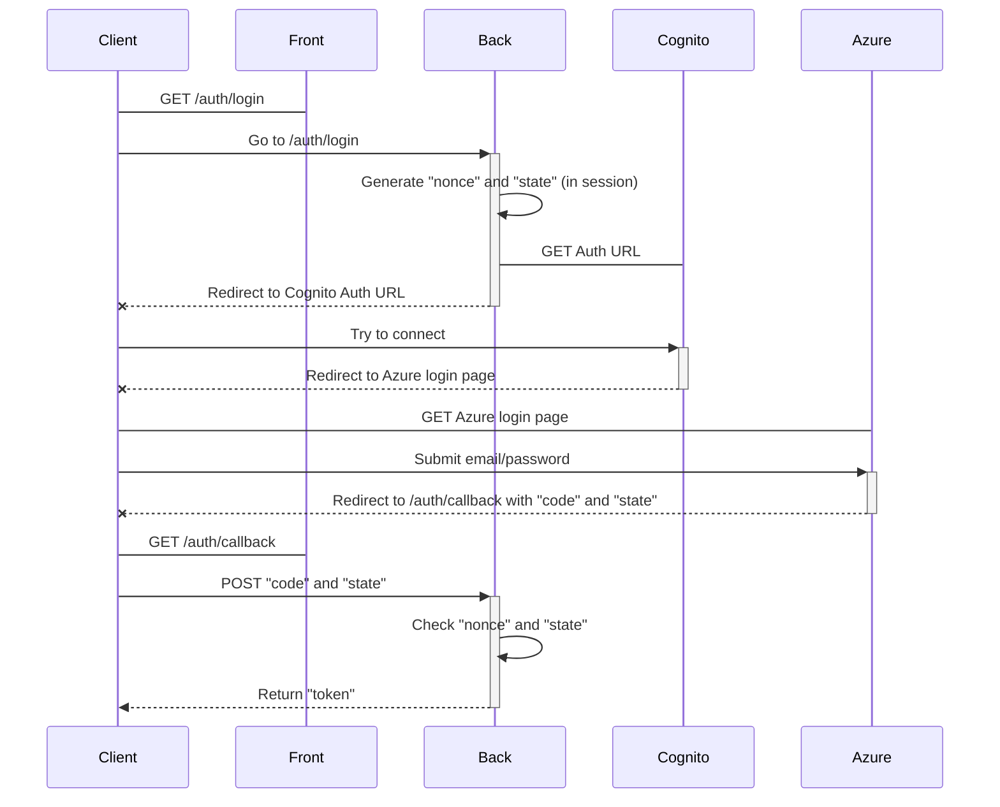

# hub-back

## Description

This is the backend of the Welcome application, that allows new collabotator to gather information about the company by step. Those steps are unlocked over time as the arrival of the new collabotator get closer.

## Setup

To install this project, follow the steps below: 

1. Clone the repository

    ```sh
    git clone https://github.com/we-are-daveo/welcome-hub-back.git
    ```

2. Install dependencies

    ```sh
    npm install
    ```

3. Setup environment variables

    A `.env` file is used to set environment variables. You can copy `.env.example` as a base.

    ```sh
    cp .env.example .env
    ```

    Then, edit the `.env` file to your needs.

4. GCP service account

    You need to initialize GCP. For that, you need to read this doc: https://github.com/we-are-daveo/welcome/blob/main/docs/GCP_deployment.md

    You must to go to the stage 'Authenticate application default', and to have the rights for start this app with GCP (see with a devOps).

5. Run the project

    1. Local

        ```sh
        npm run start:dev
        ```

    2. Docker

        You must to add the secret in ./configs/docker/docker-compose.yaml to start docker (see with a devOps for the secrets on GCP).

        > [!CAUTION]
        > docker with docker-compose, start the all environments (front & back). If you want start the back only, comment the services (hub-front & app-front)

        ```sh
        npm run docker:run:env
        ````

## In depth

### OIDC auth



### Email system

The email system works in this way:
- If the collaborator is created far before his arrival, we only notify him during the last few months before his arrival.
- If the collaborator is created a few months before his arrival, we notify him regulary.
- If the collaborator is created a few weeks/days before his arrival, we notify him one time for all.


## <a name="env-variables">🌿 Environment variables</a>

| Name                           | Description                                                   | Default value | Required |
|--------------------------------|---------------------------------------------------------------|---------------|----------|
| BREVO_API_KEY                  | The API key required by Brevo to send emails                  | -             | `true`   |
| BYPASS_GUARD                   | If true, the guard is bypassed on all endpoints               | `false`       | `false`  |
| COGNITO_CLIENT_ID              | Client ID of Cognito                                          | -             | `true`   |
| COGNITO_CLIENT_SECRET          | Client secret of Cognito                                      | -             | `true`   |
| COGNITO_REGION                 | Region of Cognito                                             | -             | `true`   |
| COGNITO_USER_POOL_ID           | User pool ID of Cognito                                       | -             | `true`   |
| CRON_API_KEY                   | Api key used for some endpoints (`welcome/run` for instance)  | -             | `true`   |
| FRONT_BASE_URL                 | The URL of the front application, used in CORS and sent email | -             | `true`   |
| GOOGLE_APPLICATION_CREDENTIALS | The service account file for google services                  | -             | `true`   |
| NAME_BUCKET_STATIC_CONTENT     | The name of the GCP bucket where the static content is stored | -             | `true`   |
| PUBLIC_URL                     | Base URL of the back                                          | `/`           | `false`  |
| SESSION_SECRET                 | Used to sign the session ID cookie                            | -             | `true`   |


## <a name="how-to-contribute">🚀 How to contribute</a>

### 🔄 Pull requests

1. Create a new branch from `develop` with the following command :

```shell
npm run script:create-git-branch
```

2. Make your changes, commit them and push them to your branch.

3. Create a pull request from your branch to `develop` with the following command :

```shell
npm run script:create-pull-request
```

4. Wait for the review and approval of your pull request.

5. Once your pull request is approved, it will be merged into `develop` and deployed to the staging environment.

## <a name="misc-commands">✨ Misc commands</a>

### 🔀 Create git branch with a conventional name
```shell
npm run script:create-git-branch
```

### ⤴️ Create pull request against the `develop` branch from current branch
```shell
npm run script:create-pull-request
```

### 🆗 Run the linter, analyzes and correct source code about stylistic issues to improve code quality
```shell
npm run lint:fix
```